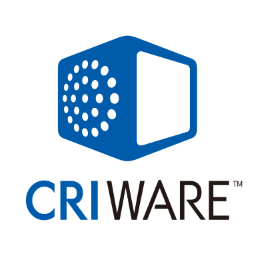

[English](README.md) / [日本語](README.ja.md)

# Live2D Cubism MotionSync Core

This folder contains platform-specific library files with using the motion sync.

**If you encounter exceptions upon first import, restart Unity**

## Library List

| Platform | Architecture | Path | Note |
| --- | --- | --- | --- |
| Android | arm64-v8a | CRI/Android/arm64-v8a |   |
| Android | x86 | CRI/Android/x86 |   |
| Android | x86_64 | CRI/Android/x86_64 |   |
| Emscripten | - | CRI/Experimental/Emscripten/3_1_8 | bitcode(upstream LLVM wasm backend) |
| iOS | ARM64 | CRI/iOS/Release-iphoneos | iOS Devices |
| iOS | ARM64 | CRI/iOS/Release-iphonesimulator | iOS Simulator |
| iOS | x86_64 | CRI/iOS/Release-iphonesimulator | iOS Simulator |
| macOS | ARM64 | CRI/macOS |   |
| macOS | x86_64 | CRI/macOS |   |
| Windows | x86 | CRI/Windows/x86 |   |
| Windows | x86_64 | CRI/Windows/x86_64 |   |

---

Powered by "CRIWARE".CRIWARE is a trademark of CRI Middleware Co., Ltd.
